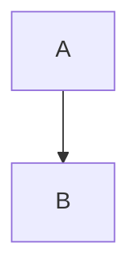

---
imports:
  - ./dist/walking-dinosaur.js
  - https://cdn.jsdelivr.net/npm/@opral/markdown-wc-doc-elements/dist/doc-video.js
---

# Markdown WC

Enables writing documentation with web components in markdown.

```markdown
---
imports:
  - https://cdn.jsdelivr.net/npm/@opral/markdown-wc/dist/walking-dinosaur.js
---

# Markdown WC

Enables writing documentation with web components in markdown.

<walking-dinosaur></walking-dinosaur>
```

<walking-dinosaur></walking-dinosaur>
<doc-video src="https://youtu.be/IMjJ1jvKsZU"></doc-video>

## Why

- Enables writing documentation with components in markdown
- Interoperable with existing markdown parsers
- Doesn't depend on a framework like [React MDX](https://mdxjs.com/) or [Svelte MDsveX](https://github.com/pngwn/MDsveX)
- Doesn't introduce custom syntax like [Markdoc](https://markdoc.dev/)

## Comparison

| Feature                | Markdown | @opral/markdown-wc | React MDX | Svelte MDsveX | Markdoc |
| ---------------------- | -------- | ------------------ | --------- | ------------- | ------- |
| Components in markdown | ❌       | ✅                 | ✅        | ✅            | ✅      |
| Framework agnostic     | ✅       | ✅                 | ❌        | ❌            | ✅      |
| Portable               | ✅       | ✅                 | ❌        | ❌            | ❌      |
| No custom syntax       | ✅       | ✅                 | ❌        | ❌            | ❌      |

Portable: the output is standard HTML + web components without framework-specific runtime requirements.

## Quick Start

Install:

```bash
npm install @opral/markdown-wc
```

Server-side (or build-time) parse:

```ts
import { parse } from "@opral/markdown-wc"

const markdown = `
# Hello World
<my-component></my-component>
`

const { html, frontmatter } = await parse(markdown)
```

Client-side: register custom elements listed in `frontmatter.imports`:

```ts
for (const url of frontmatter.imports ?? []) {
  await import(url)
}
```

Then render `html` inside a container (see Styling below).

## Usage in browser

The `<markdown-wc-embed>` element can be used to embed markdown-wc in a webpage.
It renders in the light DOM so the host page's CSS applies to embedded markdown by default.

```html
<script
	type="module"
	src="https://cdn.jsdelivr.net/npm/@opral/markdown-wc/dist/markdown-wc-embed.js"
></script>
<body>
	<markdown-wc-embed src="https://my-markdown-url.com/markdown.md"></markdown-wc-embed>
</body>
```

## Usage in another markdown file

The `<markdown-wc-embed>` element can be used to embed markdown-wc in markdown-wc.
`imports` must be a list of module URLs (array syntax). Wrap the embed in
`.markdown-wc-body` if you want the default stylesheet to apply.

```markdown
---
imports:
  - https://cdn.jsdelivr.net/npm/@opral/markdown-wc/dist/markdown-wc-embed.js
---

# Hello World

This is a markdown file that embeds another markdown file 🤯

<div class="markdown-wc-body">
  <markdown-wc-embed src="https://cdn.jsdelivr.net/gh/opral/monorepo@latest/packages/markdown-wc/README.md"></markdown-wc-embed>
</div>
```

## Usage as libary

Enables SSR and more control over the rendering process.

```ts
import { parse } from "@opral/markdown-wc"

const markdown = `

# Hello World

// This is a web component
<doc-card>
  <h1>Card Title</h1>
  <p>Card content</p>
</doc-card>
`

// Parse markdown
const parsed = parse(markdown)

// Optionally open external links in new tabs
// const parsed = parse(markdown, { externalLinks: true })

// Resolve relative asset URLs (images/links) against a base path
// Markdown: 
// Result:   /blog/my-post/assets/architecture.jpg
// const parsed = parse(markdown, { assetBaseUrl: "/blog/my-post/" })

// Register web components
for (const url of parsed.frontmatter.imports ?? []) {
	// optionally sanitize the imported imported here
	// by, for example, only trusting a specific domain
	await import(url)
}

// render HTML
render(parsed.html)
```

## Security / Sanitization

Markdown WC does not sanitize HTML output. If you render untrusted or remote
markdown, you must sanitize or trust the source before rendering.

## Styling markdown-wc

Markdown WC renders standard HTML elements (headings, paragraphs, lists, blockquotes,
code blocks, tables, etc.) and does not inject inline styles. This keeps the output
portable and allows the host application to fully control styling.

Code blocks are syntax-highlighted, but no Highlight.js stylesheet is injected.
To enable highlighting styles, load a Highlight.js theme in your app (or provide your own `.hljs` styles).

Example:

```html
<link
  rel="stylesheet"
  href="https://cdnjs.cloudflare.com/ajax/libs/highlight.js/11.8.0/styles/github-dark.min.css"
/>
```

React example:

```tsx
export function MarkdownStyles() {
  return (
    <link
      rel="stylesheet"
      href="https://cdnjs.cloudflare.com/ajax/libs/highlight.js/11.8.0/styles/github-dark.min.css"
    />
  );
}
```

To get the default look, import the bundled stylesheet and wrap your rendered HTML
with a `.markdown-wc-body` container (recommended to avoid CSS collisions). This
is also the expected styling model for `<markdown-wc-embed>`.

```css
@import "@opral/markdown-wc/default.css";
```

Or provide your own CSS. Example:

```css
/* Wrap rendered HTML in a container and style inside it */
.markdown-wc-body {
	color: #213547;
	font-size: 16px;
	line-height: 1.7;
}

.markdown-wc-body h1 {
	font-size: 2rem;
	font-weight: 600;
	margin: 0 0 1rem;
}

.markdown-wc-body h2 {
	font-size: 1.5rem;
	font-weight: 600;
	margin: 2rem 0 0.75rem;
	border-top: 1px solid #e2e2e3;
	padding-top: 1.25rem;
}

.markdown-wc-body p {
	margin: 1rem 0;
}

.markdown-wc-body a {
	color: #3a5ccc;
	text-decoration: underline;
	text-underline-offset: 3px;
}
```

Alert styling example (GitHub alerts):

```css
.markdown-wc-body blockquote[data-mwc-alert] {
	border-left: none;
	border-radius: 8px;
	padding: 12px 16px;
	margin: 1rem 0;
}

.markdown-wc-body blockquote[data-mwc-alert] [data-mwc-alert-marker] {
	display: none;
}

.markdown-wc-body blockquote[data-mwc-alert="note"] {
	background: rgba(100, 108, 255, 0.08);
	border: 1px solid rgba(100, 108, 255, 0.16);
}
.markdown-wc-body blockquote[data-mwc-alert="note"]::before {
	content: "Note";
	display: block;
	font-weight: 600;
	margin-bottom: 0.5rem;
	color: #3451b2;
}
```

Code block styling / copy button hook example:

```css
.markdown-wc-body pre[data-mwc-codeblock] {
	position: relative;
	padding: 16px 20px;
	border-radius: 8px;
	background: #f6f6f7;
	overflow-x: auto;
}

.markdown-wc-body pre[data-mwc-codeblock] > button[data-mwc-copy-button] {
	position: absolute;
	top: 8px;
	right: 8px;
	font-size: 12px;
	padding: 4px 8px;
	border-radius: 6px;
	border: 1px solid #e2e2e3;
	background: #fff;
	opacity: 0;
}

.markdown-wc-body pre[data-mwc-codeblock]:hover > button[data-mwc-copy-button] {
	opacity: 1;
}
```

## Limitations

- sanitzation of markdown as well as custom elements is not implemented atm
- SSR is DIY atm (use the `parse` function and SSR the markdown with [lit for example](https://lit.dev/docs/ssr/overview/))

## GitHub-style alerts / callouts

Markdown WC recognizes GitHub-style alert syntax inside blockquotes:

```md
> [!NOTE]
> Highlights information that users should take into account.

> [!TIP]
> A helpful tip.

> [!IMPORTANT]
> Crucial information necessary for users to succeed.

> [!WARNING]
> Critical content demanding immediate attention.

> [!CAUTION]
> Dangerous or destructive actions.
```

### Rendered HTML

Alerts are emitted as normal blockquotes annotated with data attributes:

```html
<blockquote data-mwc-alert="note">
	<p>
		<span data-mwc-alert-marker>[!NOTE]</span>
		Highlights information that users should take into account.
	</p>
</blockquote>
```

Supported alert types: `note`, `tip`, `important`, `warning`, `caution`.

### Styling alerts

Markdown WC does not ship alert CSS. Style them in your site using the data attributes.

Example (VitePress-like):

```css
blockquote[data-mwc-alert] {
	border-left: none;
	border-radius: 8px;
	padding: 16px;
	margin: 16px 0;
}

blockquote[data-mwc-alert] [data-mwc-alert-marker] {
	display: none;
}

blockquote[data-mwc-alert="note"] {
	background: rgba(100, 108, 255, 0.08);
	border: 1px solid rgba(100, 108, 255, 0.16);
}
blockquote[data-mwc-alert="note"]::before {
	content: "Note";
	font-weight: 600;
	color: #3451b2;
	display: block;
	margin-bottom: 8px;
}
```

## Code blocks and copy buttons

Markdown WC keeps code blocks portable by rendering standard HTML:

```html
<pre data-mwc-codeblock>
  <code class="language-js">...</code>
</pre>
```

The `data-mwc-codeblock` attribute is a stable hook for consumer styling and
client-side hydration such as adding a “Copy” button. Markdown WC intentionally
does not render custom UI elements for code blocks; consumers should implement
copy buttons and other enhancements with CSS and client-side scripts to keep the
renderer framework-agnostic and portable.

Example copy-button script (based on inlang website-v2). This targets code blocks
inside `.markdown-wc-body` and appends a `button.mwc-copy-button`:

```ts
const COPY_BUTTON_CLASS = "mwc-copy-button"

function ensureCopyButtons(root: Document | Element = document) {
  const blocks = root.querySelectorAll(".markdown-wc-body pre:has(> code)")
  for (const pre of blocks) {
    if (pre.querySelector(`.${COPY_BUTTON_CLASS}`)) continue

    const button = document.createElement("button")
    button.type = "button"
    button.className = COPY_BUTTON_CLASS
    button.textContent = "Copy"
    ;(pre as HTMLElement).style.position = "relative"
    pre.appendChild(button)
  }
}

function handleCopyClick(event: Event) {
  const target = event.target
  if (!(target instanceof HTMLElement)) return
  const button = target.closest(`.${COPY_BUTTON_CLASS}`)
  if (!button) return

  const pre = button.closest("pre")
  const code = pre?.querySelector("code")?.textContent ?? ""
  navigator.clipboard.writeText(code)

  const previous = button.textContent
  button.textContent = "Copied!"
  window.setTimeout(() => {
    button.textContent = previous || "Copy"
  }, 1500)
}

export function initMarkdownCopyButtons() {
  if (typeof window === "undefined") return
  ensureCopyButtons()
  document.addEventListener("click", handleCopyClick)

  const observer = new MutationObserver(() => ensureCopyButtons())
  observer.observe(document.body, { childList: true, subtree: true })
}
```

## Mermaid diagrams

Markdown WC supports Mermaid fenced code blocks:

```md

```

When Mermaid blocks are detected, Markdown WC emits a `<markdown-wc-mermaid>` element and adds an import URL to frontmatter:

```ts
const { html, frontmatter } = await parse(markdown)
// frontmatter.imports includes:
// "https://cdn.jsdelivr.net/npm/@opral/markdown-wc/dist/markdown-wc-mermaid.js"
```

Consumers must load `frontmatter.imports` on the client so the custom element is registered before render.

## FAQ

### Why not use React MDX or Svelte MDsveX?

React MDX and Svelte MDsveX are great tools but they introduce a dependency on a specific framework which is a no-go for portability.

### Why not use a `<script>` tag to import the web components?

Markdown parsers don't remove the `<script>` tag from the output. This means that the script tag would be rendered in the final HTML. To increase interoperability, frontmatter is used to define imports.
